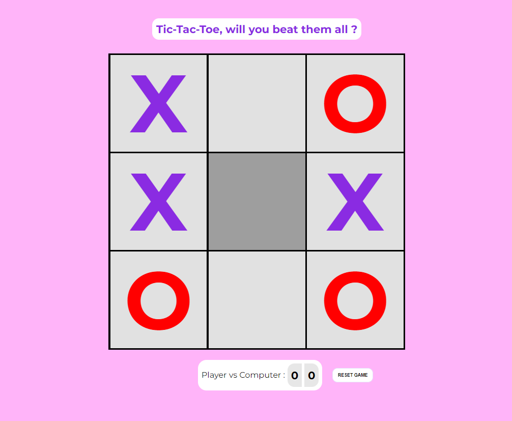
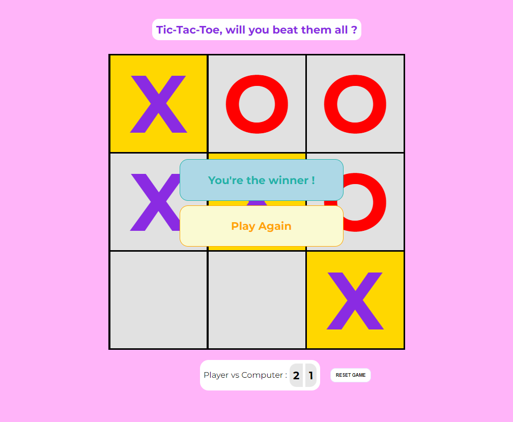
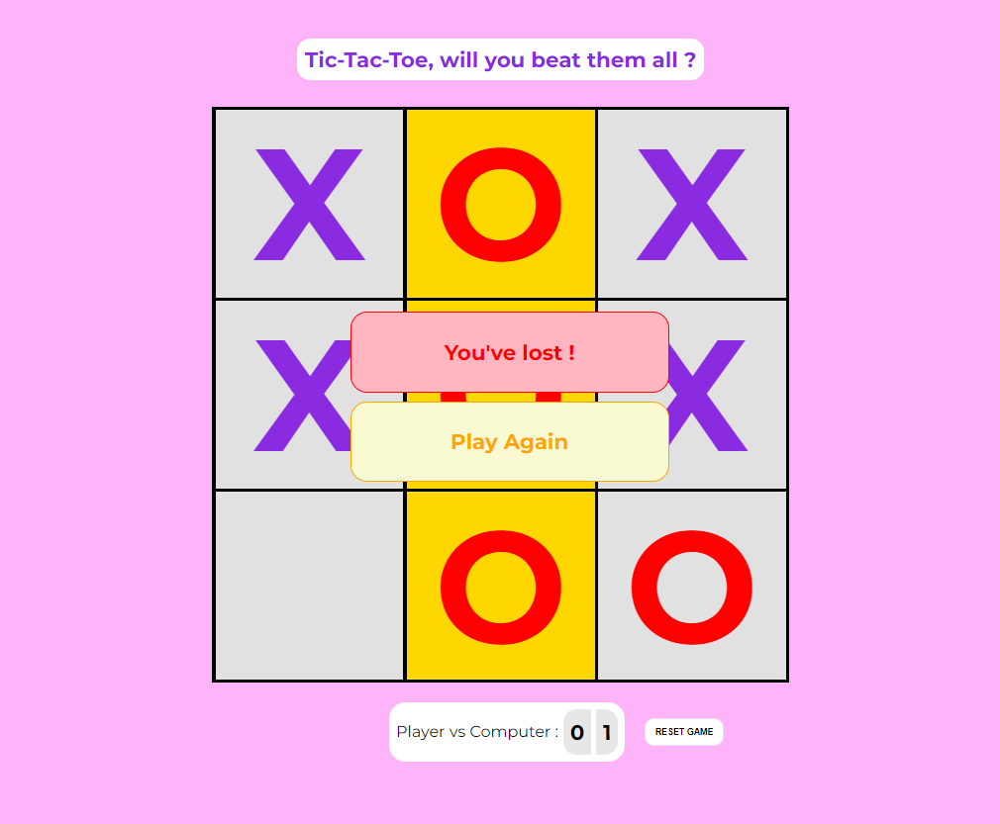
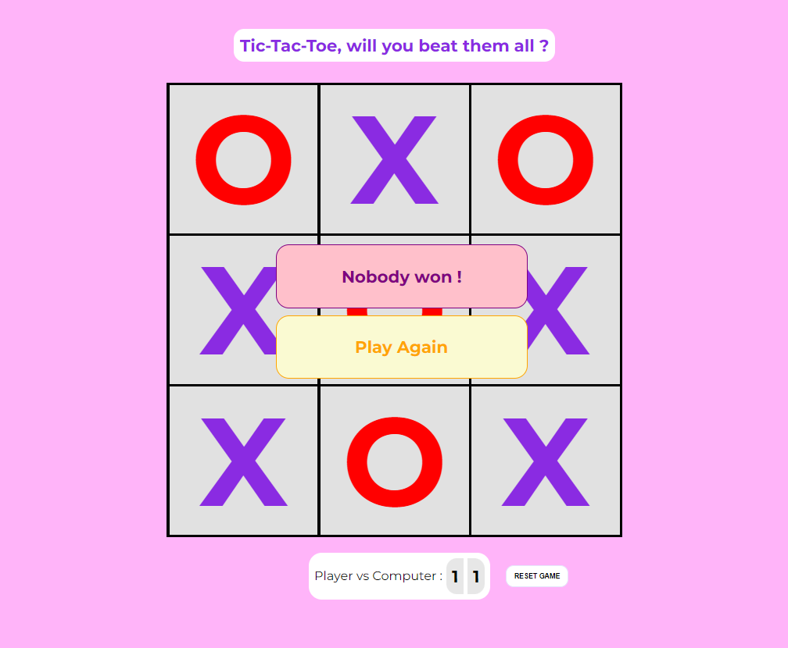

# Tic Tac Toe Game

It required some effort, but I did it within a few hours. 

Here's my **first game in JavaScript**. 

My first game **ever** !

The code could be improved and I'm willing to do so. I'm still learning the basics of JavaScript. It might take time, but I'll make it. 

Checkout the different scenarios below :

- This is what it looks with extremely basic CSS : 

- Victory 

- Defeat ?!

- Tie !

